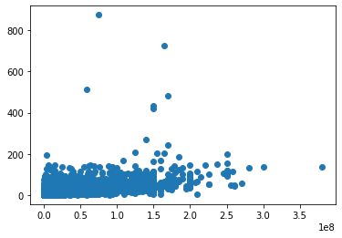
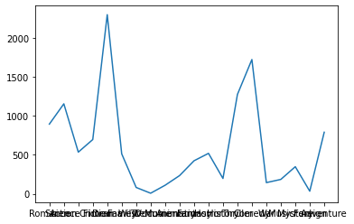

# a2-template

### Create a new conda environment with python 3.7

```
conda create -n dbms2022 python=3.7
```

### Activate

```
conda activate dbm2022
```

### Follow the following guide to install MySQL on your system.

[InstallationGuide](https://dev.mysql.com/doc/refman/8.0/en/installing.html)

### Install python myql connector

```
pip install MySQL-python
```

### Create the dir to log query outputs which will be autograded.

```
mkdir query_outputs
```

# Assignment 1

# Movies Database

```python
import pandas as pd
import numpy as np
import matplotlib.pyplot as plt
import ast
```

```python
# Movies Database Features used for EDA --> 'budget', 'genres',
#        'original_title', 'popularity', 'production_companies',
#        'release_date', 'revenue', 'runtime',
#        'vote_average', 'vote_count'


movies_database = pd.read_csv("movies_info.csv")
movies_database = movies_database[['budget', 'genres', 'original_title', 'popularity', 'production_companies',
                                   'release_date', 'revenue', 'runtime', 'vote_average', 'vote_count']]
movies_database.head(2)
```

<div>
<style scoped>
    .dataframe tbody tr th:only-of-type {
        vertical-align: middle;
    }

    .dataframe tbody tr th {
        vertical-align: top;
    }

    .dataframe thead th {
        text-align: right;
    }

</style>
<table border="1" class="dataframe">
  <thead>
    <tr style="text-align: right;">
      <th></th>
      <th>budget</th>
      <th>genres</th>
      <th>original_title</th>
      <th>popularity</th>
      <th>production_companies</th>
      <th>release_date</th>
      <th>revenue</th>
      <th>runtime</th>
      <th>vote_average</th>
      <th>vote_count</th>
    </tr>
  </thead>
  <tbody>
    <tr>
      <th>0</th>
      <td>237000000</td>
      <td>[{"id": 28, "name": "Action"}, {"id": 12, "nam...</td>
      <td>Avatar</td>
      <td>150.437577</td>
      <td>[{"name": "Ingenious Film Partners", "id": 289...</td>
      <td>2009-12-10</td>
      <td>2787965087</td>
      <td>162.0</td>
      <td>7.2</td>
      <td>11800</td>
    </tr>
    <tr>
      <th>1</th>
      <td>300000000</td>
      <td>[{"id": 12, "name": "Adventure"}, {"id": 14, "...</td>
      <td>Pirates of the Caribbean: At World's End</td>
      <td>139.082615</td>
      <td>[{"name": "Walt Disney Pictures", "id": 2}, {"...</td>
      <td>2007-05-19</td>
      <td>961000000</td>
      <td>169.0</td>
      <td>6.9</td>
      <td>4500</td>
    </tr>
  </tbody>
</table>
</div>

```python
movies_database.describe()
```

<div>
<style scoped>
    .dataframe tbody tr th:only-of-type {
        vertical-align: middle;
    }

    .dataframe tbody tr th {
        vertical-align: top;
    }

    .dataframe thead th {
        text-align: right;
    }

</style>
<table border="1" class="dataframe">
  <thead>
    <tr style="text-align: right;">
      <th></th>
      <th>budget</th>
      <th>popularity</th>
      <th>revenue</th>
      <th>runtime</th>
      <th>vote_average</th>
      <th>vote_count</th>
    </tr>
  </thead>
  <tbody>
    <tr>
      <th>count</th>
      <td>4.803000e+03</td>
      <td>4803.000000</td>
      <td>4.803000e+03</td>
      <td>4801.000000</td>
      <td>4803.000000</td>
      <td>4803.000000</td>
    </tr>
    <tr>
      <th>mean</th>
      <td>2.904504e+07</td>
      <td>21.492301</td>
      <td>8.226064e+07</td>
      <td>106.875859</td>
      <td>6.092172</td>
      <td>690.217989</td>
    </tr>
    <tr>
      <th>std</th>
      <td>4.072239e+07</td>
      <td>31.816650</td>
      <td>1.628571e+08</td>
      <td>22.611935</td>
      <td>1.194612</td>
      <td>1234.585891</td>
    </tr>
    <tr>
      <th>min</th>
      <td>0.000000e+00</td>
      <td>0.000000</td>
      <td>0.000000e+00</td>
      <td>0.000000</td>
      <td>0.000000</td>
      <td>0.000000</td>
    </tr>
    <tr>
      <th>25%</th>
      <td>7.900000e+05</td>
      <td>4.668070</td>
      <td>0.000000e+00</td>
      <td>94.000000</td>
      <td>5.600000</td>
      <td>54.000000</td>
    </tr>
    <tr>
      <th>50%</th>
      <td>1.500000e+07</td>
      <td>12.921594</td>
      <td>1.917000e+07</td>
      <td>103.000000</td>
      <td>6.200000</td>
      <td>235.000000</td>
    </tr>
    <tr>
      <th>75%</th>
      <td>4.000000e+07</td>
      <td>28.313505</td>
      <td>9.291719e+07</td>
      <td>118.000000</td>
      <td>6.800000</td>
      <td>737.000000</td>
    </tr>
    <tr>
      <th>max</th>
      <td>3.800000e+08</td>
      <td>875.581305</td>
      <td>2.787965e+09</td>
      <td>338.000000</td>
      <td>10.000000</td>
      <td>13752.000000</td>
    </tr>
  </tbody>
</table>
</div>

```python
def object_to_list(pd_df):
    x = ast.literal_eval(pd_df)
    return x
```

```python
# Converting type of genres and production_companies columns datatype to lists... Function used --> object_to_list()

movies_database['genres'] = movies_database['genres'].apply(object_to_list)
movies_database['production_companies'] = movies_database['production_companies'].apply(object_to_list)
```

```python
movies_database
```

<div>
<style scoped>
    .dataframe tbody tr th:only-of-type {
        vertical-align: middle;
    }

    .dataframe tbody tr th {
        vertical-align: top;
    }

    .dataframe thead th {
        text-align: right;
    }

</style>
<table border="1" class="dataframe">
  <thead>
    <tr style="text-align: right;">
      <th></th>
      <th>budget</th>
      <th>genres</th>
      <th>original_title</th>
      <th>popularity</th>
      <th>production_companies</th>
      <th>release_date</th>
      <th>revenue</th>
      <th>runtime</th>
      <th>vote_average</th>
      <th>vote_count</th>
    </tr>
  </thead>
  <tbody>
    <tr>
      <th>0</th>
      <td>237000000</td>
      <td>[{'id': 28, 'name': 'Action'}, {'id': 12, 'nam...</td>
      <td>Avatar</td>
      <td>150.437577</td>
      <td>[{'name': 'Ingenious Film Partners', 'id': 289...</td>
      <td>2009-12-10</td>
      <td>2787965087</td>
      <td>162.0</td>
      <td>7.2</td>
      <td>11800</td>
    </tr>
    <tr>
      <th>1</th>
      <td>300000000</td>
      <td>[{'id': 12, 'name': 'Adventure'}, {'id': 14, '...</td>
      <td>Pirates of the Caribbean: At World's End</td>
      <td>139.082615</td>
      <td>[{'name': 'Walt Disney Pictures', 'id': 2}, {'...</td>
      <td>2007-05-19</td>
      <td>961000000</td>
      <td>169.0</td>
      <td>6.9</td>
      <td>4500</td>
    </tr>
    <tr>
      <th>2</th>
      <td>245000000</td>
      <td>[{'id': 28, 'name': 'Action'}, {'id': 12, 'nam...</td>
      <td>Spectre</td>
      <td>107.376788</td>
      <td>[{'name': 'Columbia Pictures', 'id': 5}, {'nam...</td>
      <td>2015-10-26</td>
      <td>880674609</td>
      <td>148.0</td>
      <td>6.3</td>
      <td>4466</td>
    </tr>
    <tr>
      <th>3</th>
      <td>250000000</td>
      <td>[{'id': 28, 'name': 'Action'}, {'id': 80, 'nam...</td>
      <td>The Dark Knight Rises</td>
      <td>112.312950</td>
      <td>[{'name': 'Legendary Pictures', 'id': 923}, {'...</td>
      <td>2012-07-16</td>
      <td>1084939099</td>
      <td>165.0</td>
      <td>7.6</td>
      <td>9106</td>
    </tr>
    <tr>
      <th>4</th>
      <td>260000000</td>
      <td>[{'id': 28, 'name': 'Action'}, {'id': 12, 'nam...</td>
      <td>John Carter</td>
      <td>43.926995</td>
      <td>[{'name': 'Walt Disney Pictures', 'id': 2}]</td>
      <td>2012-03-07</td>
      <td>284139100</td>
      <td>132.0</td>
      <td>6.1</td>
      <td>2124</td>
    </tr>
    <tr>
      <th>...</th>
      <td>...</td>
      <td>...</td>
      <td>...</td>
      <td>...</td>
      <td>...</td>
      <td>...</td>
      <td>...</td>
      <td>...</td>
      <td>...</td>
      <td>...</td>
    </tr>
    <tr>
      <th>4798</th>
      <td>220000</td>
      <td>[{'id': 28, 'name': 'Action'}, {'id': 80, 'nam...</td>
      <td>El Mariachi</td>
      <td>14.269792</td>
      <td>[{'name': 'Columbia Pictures', 'id': 5}]</td>
      <td>1992-09-04</td>
      <td>2040920</td>
      <td>81.0</td>
      <td>6.6</td>
      <td>238</td>
    </tr>
    <tr>
      <th>4799</th>
      <td>9000</td>
      <td>[{'id': 35, 'name': 'Comedy'}, {'id': 10749, '...</td>
      <td>Newlyweds</td>
      <td>0.642552</td>
      <td>[]</td>
      <td>2011-12-26</td>
      <td>0</td>
      <td>85.0</td>
      <td>5.9</td>
      <td>5</td>
    </tr>
    <tr>
      <th>4800</th>
      <td>0</td>
      <td>[{'id': 35, 'name': 'Comedy'}, {'id': 18, 'nam...</td>
      <td>Signed, Sealed, Delivered</td>
      <td>1.444476</td>
      <td>[{'name': 'Front Street Pictures', 'id': 3958}...</td>
      <td>2013-10-13</td>
      <td>0</td>
      <td>120.0</td>
      <td>7.0</td>
      <td>6</td>
    </tr>
    <tr>
      <th>4801</th>
      <td>0</td>
      <td>[]</td>
      <td>Shanghai Calling</td>
      <td>0.857008</td>
      <td>[]</td>
      <td>2012-05-03</td>
      <td>0</td>
      <td>98.0</td>
      <td>5.7</td>
      <td>7</td>
    </tr>
    <tr>
      <th>4802</th>
      <td>0</td>
      <td>[{'id': 99, 'name': 'Documentary'}]</td>
      <td>My Date with Drew</td>
      <td>1.929883</td>
      <td>[{'name': 'rusty bear entertainment', 'id': 87...</td>
      <td>2005-08-05</td>
      <td>0</td>
      <td>90.0</td>
      <td>6.3</td>
      <td>16</td>
    </tr>
  </tbody>
</table>
<p>4803 rows × 10 columns</p>
</div>

```python
# Movies Budget and Popularity Overview
plt.scatter(movies_database.budget, movies_database.popularity)

# Can be plotted with Pandas too
# df.plot(kind='scatter', x='col1', y='col2', s=df.col3)
```

    <matplotlib.collections.PathCollection at 0x255d8825588>



```python
# Extracting the Unique Genres used in this Database
genres = set()

def extract_genres(list_of_map):
    for map_genre in list_of_map:
        genres.add(map_genre['name'])

for index, row in movies_database.iterrows():
    extract_genres(row['genres'])

genres = list(genres)
print(genres)
```

    ['Romance', 'Action', 'Science Fiction', 'Crime', 'Drama', 'Family', 'Western', 'TV Movie', 'Documentary', 'Animation', 'Fantasy', 'Horror', 'History', 'Thriller', 'Comedy', 'War', 'Music', 'Mystery', 'Foreign', 'Adventure']

```python
# Exploring the most used genres.....
def genres_movies(genre, list_of_map):
    for movie_genre_detail in list_of_map:
        if movie_genre_detail['name'] == genre:
            return True
    return False

def count_genre(dataframe, genre):
    count = 0
    for index, row in dataframe.iterrows():
        if genres_movies(genre, row['genres']):
            count+=1
    return count

# Exploring Genres and their Counts
result = {}
for genre in genres:
    result[genre] = count_genre(movies_database, genre)

plt.plot(result.keys(), result.values())
```

    [<matplotlib.lines.Line2D at 0x255d8869088>]



# Generating SQL Database from CSV File using Pandas

```python
import pandas as pd
import MySQLdb
import ast
import warnings

warnings.filterwarnings("ignore")
```

```python
def object_to_list(pd_df):
    x = ast.literal_eval(pd_df)
    return x

# '[{}, {}]' --> [{}, {}]
```

```python
db = MySQLdb.connect(host="localhost", user="root", passwd="1552454fghLPSK@$")

c = db.cursor()

c.execute("CREATE DATABASE IF NOT EXISTS moviesDb")
c.execute("USE moviesDb")

# db.close()
```

    0

##### Creating genres_movies table (id, genre, movie)

```python
c.execute("DROP TABLE IF EXISTS genres_movies") # Drop the table if already exists
# Create a table if not exists

c.execute("CREATE TABLE IF NOT EXISTS genres_movies (ID INT(255), genre VARCHAR(20), movie VARCHAR(90))")
c.execute("SHOW tables")

for x in c:
    print(x)
```

    ('genres_movies',)
    ('movies',)

```python
# Converting specific columns movies titles and genres into specific datastructures
# Initially genres column contained strings, so string object converted to list using object_to_list() function.

df = pd.read_csv("movies_info.csv")
movies_genres = df[['original_title', 'genres']]

movies_genres['genres'] = movies_genres['genres'].apply(lambda x: object_to_list(x))
movies_genres
```

<div>
<style scoped>
    .dataframe tbody tr th:only-of-type {
        vertical-align: middle;
    }

    .dataframe tbody tr th {
        vertical-align: top;
    }

    .dataframe thead th {
        text-align: right;
    }

</style>
<table border="1" class="dataframe">
  <thead>
    <tr style="text-align: right;">
      <th></th>
      <th>original_title</th>
      <th>genres</th>
    </tr>
  </thead>
  <tbody>
    <tr>
      <th>0</th>
      <td>Avatar</td>
      <td>[{'id': 28, 'name': 'Action'}, {'id': 12, 'nam...</td>
    </tr>
    <tr>
      <th>1</th>
      <td>Pirates of the Caribbean: At World's End</td>
      <td>[{'id': 12, 'name': 'Adventure'}, {'id': 14, '...</td>
    </tr>
    <tr>
      <th>2</th>
      <td>Spectre</td>
      <td>[{'id': 28, 'name': 'Action'}, {'id': 12, 'nam...</td>
    </tr>
    <tr>
      <th>3</th>
      <td>The Dark Knight Rises</td>
      <td>[{'id': 28, 'name': 'Action'}, {'id': 80, 'nam...</td>
    </tr>
    <tr>
      <th>4</th>
      <td>John Carter</td>
      <td>[{'id': 28, 'name': 'Action'}, {'id': 12, 'nam...</td>
    </tr>
    <tr>
      <th>...</th>
      <td>...</td>
      <td>...</td>
    </tr>
    <tr>
      <th>4798</th>
      <td>El Mariachi</td>
      <td>[{'id': 28, 'name': 'Action'}, {'id': 80, 'nam...</td>
    </tr>
    <tr>
      <th>4799</th>
      <td>Newlyweds</td>
      <td>[{'id': 35, 'name': 'Comedy'}, {'id': 10749, '...</td>
    </tr>
    <tr>
      <th>4800</th>
      <td>Signed, Sealed, Delivered</td>
      <td>[{'id': 35, 'name': 'Comedy'}, {'id': 18, 'nam...</td>
    </tr>
    <tr>
      <th>4801</th>
      <td>Shanghai Calling</td>
      <td>[]</td>
    </tr>
    <tr>
      <th>4802</th>
      <td>My Date with Drew</td>
      <td>[{'id': 99, 'name': 'Documentary'}]</td>
    </tr>
  </tbody>
</table>
<p>4803 rows × 2 columns</p>
</div>

```python
# Extracting MAX Char len of genre
# Extracting Max ID INT
# Extracting length and int possible values for Database Table schema defination

id, length = -1, -1
for index, row in movies_genres.iterrows():
#     print(row['original_title'])
#     print(row['genres'])
    for genre_object in (row['genres']):
        if genre_object['id'] > id:
            id = genre_object['id']
    for genre_object in (row['genres']):
        if len(genre_object['name']) > length:
            length = len(genre_object['name'])


# Extracting Maximum length of movie name
movie_length = -1
for movie_name in movies_genres['original_title']:
    if len(movie_name) > movie_length:
        movie_length = len(movie_name)

print(id, length, movie_length)
```

    10770 15 86

```python
# Creating the SQL table genres_movies in the form (ID, genre, movie_name)
for index, row in movies_genres.iterrows():
#     print(row['genres'])
#     print(row['original_title'])
    for genre in row['genres']:
#         print(genre['id'], row['original_title'])
        sql = "INSERT INTO genres_movies (id, genre, movie) VALUES (%s, %s, %s)"
        val = (genre['id'], genre['name'], row['original_title'])
        c.execute(sql, val)
        db.commit()
```

```python
# c.execute("SELECT * from genres_movies")
# for index, row in enumerate(c):
#     print(row)
# print(index)
```

##### Creating companies_movies table (id, production_company, movie)

```python
c.execute("DROP TABLE IF EXISTS companies_movies") # Drop the table if already exists
# Create a table if not exists

c.execute("CREATE TABLE IF NOT EXISTS companies_movies (ID INT(255), company VARCHAR(500), movie VARCHAR(90))")
c.execute("SHOW tables")

for x in c:
    print(x)
```

    ('companies_movies',)
    ('genres_movies',)
    ('movies',)

```python
# Converting specific columns movies production companies and movies into specific datastructures
# Initially production_companies column contained strings, so string object converted to list using object_to_list() function.

df = pd.read_csv("movies_info.csv")
movies_companies = df[['original_title', 'production_companies']]

movies_companies['production_companies'] = movies_companies['production_companies'].apply(lambda x: object_to_list(x))
movies_companies
```

<div>
<style scoped>
    .dataframe tbody tr th:only-of-type {
        vertical-align: middle;
    }

    .dataframe tbody tr th {
        vertical-align: top;
    }

    .dataframe thead th {
        text-align: right;
    }

</style>
<table border="1" class="dataframe">
  <thead>
    <tr style="text-align: right;">
      <th></th>
      <th>original_title</th>
      <th>production_companies</th>
    </tr>
  </thead>
  <tbody>
    <tr>
      <th>0</th>
      <td>Avatar</td>
      <td>[{'name': 'Ingenious Film Partners', 'id': 289...</td>
    </tr>
    <tr>
      <th>1</th>
      <td>Pirates of the Caribbean: At World's End</td>
      <td>[{'name': 'Walt Disney Pictures', 'id': 2}, {'...</td>
    </tr>
    <tr>
      <th>2</th>
      <td>Spectre</td>
      <td>[{'name': 'Columbia Pictures', 'id': 5}, {'nam...</td>
    </tr>
    <tr>
      <th>3</th>
      <td>The Dark Knight Rises</td>
      <td>[{'name': 'Legendary Pictures', 'id': 923}, {'...</td>
    </tr>
    <tr>
      <th>4</th>
      <td>John Carter</td>
      <td>[{'name': 'Walt Disney Pictures', 'id': 2}]</td>
    </tr>
    <tr>
      <th>...</th>
      <td>...</td>
      <td>...</td>
    </tr>
    <tr>
      <th>4798</th>
      <td>El Mariachi</td>
      <td>[{'name': 'Columbia Pictures', 'id': 5}]</td>
    </tr>
    <tr>
      <th>4799</th>
      <td>Newlyweds</td>
      <td>[]</td>
    </tr>
    <tr>
      <th>4800</th>
      <td>Signed, Sealed, Delivered</td>
      <td>[{'name': 'Front Street Pictures', 'id': 3958}...</td>
    </tr>
    <tr>
      <th>4801</th>
      <td>Shanghai Calling</td>
      <td>[]</td>
    </tr>
    <tr>
      <th>4802</th>
      <td>My Date with Drew</td>
      <td>[{'name': 'rusty bear entertainment', 'id': 87...</td>
    </tr>
  </tbody>
</table>
<p>4803 rows × 2 columns</p>
</div>

```python
# Extracting MAX Char len of production company
# Extracting Max ID INT

id, length = -1, -1
for index, row in movies_companies.iterrows():
#     print(row['original_title'])
#     print(row['production_companies'])
    for company_object in (row['production_companies']):
        if company_object['id'] > id:
            id = company_object['id']
        if len(company_object['name']) > length:
            length = len(company_object['name'])

print(id, length)
```

    95063 77

```python
# Creating the SQL table companies_movies in the form (ID, company, movie_name)
for index, row in movies_companies.iterrows():
#     print(row['production_companies'])
#     print(row['original_title'])
    for company in row['production_companies']:

        sql = "INSERT INTO companies_movies (id, company, movie) VALUES (%s, %s, %s)"
        val = (company['id'], company['name'], row['original_title'])
        c.execute(sql, val)
        db.commit()
```

```python
# c.execute("SELECT * from companies_movies")
# for index, row in enumerate(c):
#     print(row)
# print(index)
```

##### Creating a Major Table (budget, id, popularity, release_date, revenue, runtime, original_title, vote_average, vote_count)

```python
major_table = df[['id', 'original_title', 'budget', 'revenue', 'popularity', 'runtime', 'vote_average', 'vote_count', 'release_date']]
major_table
```

<div>
<style scoped>
    .dataframe tbody tr th:only-of-type {
        vertical-align: middle;
    }

    .dataframe tbody tr th {
        vertical-align: top;
    }

    .dataframe thead th {
        text-align: right;
    }

</style>
<table border="1" class="dataframe">
  <thead>
    <tr style="text-align: right;">
      <th></th>
      <th>id</th>
      <th>original_title</th>
      <th>budget</th>
      <th>revenue</th>
      <th>popularity</th>
      <th>runtime</th>
      <th>vote_average</th>
      <th>vote_count</th>
      <th>release_date</th>
    </tr>
  </thead>
  <tbody>
    <tr>
      <th>0</th>
      <td>19995</td>
      <td>Avatar</td>
      <td>237000000</td>
      <td>2787965087</td>
      <td>150.437577</td>
      <td>162.0</td>
      <td>7.2</td>
      <td>11800</td>
      <td>2009-12-10</td>
    </tr>
    <tr>
      <th>1</th>
      <td>285</td>
      <td>Pirates of the Caribbean: At World's End</td>
      <td>300000000</td>
      <td>961000000</td>
      <td>139.082615</td>
      <td>169.0</td>
      <td>6.9</td>
      <td>4500</td>
      <td>2007-05-19</td>
    </tr>
    <tr>
      <th>2</th>
      <td>206647</td>
      <td>Spectre</td>
      <td>245000000</td>
      <td>880674609</td>
      <td>107.376788</td>
      <td>148.0</td>
      <td>6.3</td>
      <td>4466</td>
      <td>2015-10-26</td>
    </tr>
    <tr>
      <th>3</th>
      <td>49026</td>
      <td>The Dark Knight Rises</td>
      <td>250000000</td>
      <td>1084939099</td>
      <td>112.312950</td>
      <td>165.0</td>
      <td>7.6</td>
      <td>9106</td>
      <td>2012-07-16</td>
    </tr>
    <tr>
      <th>4</th>
      <td>49529</td>
      <td>John Carter</td>
      <td>260000000</td>
      <td>284139100</td>
      <td>43.926995</td>
      <td>132.0</td>
      <td>6.1</td>
      <td>2124</td>
      <td>2012-03-07</td>
    </tr>
    <tr>
      <th>...</th>
      <td>...</td>
      <td>...</td>
      <td>...</td>
      <td>...</td>
      <td>...</td>
      <td>...</td>
      <td>...</td>
      <td>...</td>
      <td>...</td>
    </tr>
    <tr>
      <th>4798</th>
      <td>9367</td>
      <td>El Mariachi</td>
      <td>220000</td>
      <td>2040920</td>
      <td>14.269792</td>
      <td>81.0</td>
      <td>6.6</td>
      <td>238</td>
      <td>1992-09-04</td>
    </tr>
    <tr>
      <th>4799</th>
      <td>72766</td>
      <td>Newlyweds</td>
      <td>9000</td>
      <td>0</td>
      <td>0.642552</td>
      <td>85.0</td>
      <td>5.9</td>
      <td>5</td>
      <td>2011-12-26</td>
    </tr>
    <tr>
      <th>4800</th>
      <td>231617</td>
      <td>Signed, Sealed, Delivered</td>
      <td>0</td>
      <td>0</td>
      <td>1.444476</td>
      <td>120.0</td>
      <td>7.0</td>
      <td>6</td>
      <td>2013-10-13</td>
    </tr>
    <tr>
      <th>4801</th>
      <td>126186</td>
      <td>Shanghai Calling</td>
      <td>0</td>
      <td>0</td>
      <td>0.857008</td>
      <td>98.0</td>
      <td>5.7</td>
      <td>7</td>
      <td>2012-05-03</td>
    </tr>
    <tr>
      <th>4802</th>
      <td>25975</td>
      <td>My Date with Drew</td>
      <td>0</td>
      <td>0</td>
      <td>1.929883</td>
      <td>90.0</td>
      <td>6.3</td>
      <td>16</td>
      <td>2005-08-05</td>
    </tr>
  </tbody>
</table>
<p>4803 rows × 9 columns</p>
</div>

```python
major_table.describe()
```

<div>
<style scoped>
    .dataframe tbody tr th:only-of-type {
        vertical-align: middle;
    }

    .dataframe tbody tr th {
        vertical-align: top;
    }

    .dataframe thead th {
        text-align: right;
    }

</style>
<table border="1" class="dataframe">
  <thead>
    <tr style="text-align: right;">
      <th></th>
      <th>id</th>
      <th>budget</th>
      <th>revenue</th>
      <th>popularity</th>
      <th>runtime</th>
      <th>vote_average</th>
      <th>vote_count</th>
    </tr>
  </thead>
  <tbody>
    <tr>
      <th>count</th>
      <td>4803.000000</td>
      <td>4.803000e+03</td>
      <td>4.803000e+03</td>
      <td>4803.000000</td>
      <td>4801.000000</td>
      <td>4803.000000</td>
      <td>4803.000000</td>
    </tr>
    <tr>
      <th>mean</th>
      <td>57165.484281</td>
      <td>2.904504e+07</td>
      <td>8.226064e+07</td>
      <td>21.492301</td>
      <td>106.875859</td>
      <td>6.092172</td>
      <td>690.217989</td>
    </tr>
    <tr>
      <th>std</th>
      <td>88694.614033</td>
      <td>4.072239e+07</td>
      <td>1.628571e+08</td>
      <td>31.816650</td>
      <td>22.611935</td>
      <td>1.194612</td>
      <td>1234.585891</td>
    </tr>
    <tr>
      <th>min</th>
      <td>5.000000</td>
      <td>0.000000e+00</td>
      <td>0.000000e+00</td>
      <td>0.000000</td>
      <td>0.000000</td>
      <td>0.000000</td>
      <td>0.000000</td>
    </tr>
    <tr>
      <th>25%</th>
      <td>9014.500000</td>
      <td>7.900000e+05</td>
      <td>0.000000e+00</td>
      <td>4.668070</td>
      <td>94.000000</td>
      <td>5.600000</td>
      <td>54.000000</td>
    </tr>
    <tr>
      <th>50%</th>
      <td>14629.000000</td>
      <td>1.500000e+07</td>
      <td>1.917000e+07</td>
      <td>12.921594</td>
      <td>103.000000</td>
      <td>6.200000</td>
      <td>235.000000</td>
    </tr>
    <tr>
      <th>75%</th>
      <td>58610.500000</td>
      <td>4.000000e+07</td>
      <td>9.291719e+07</td>
      <td>28.313505</td>
      <td>118.000000</td>
      <td>6.800000</td>
      <td>737.000000</td>
    </tr>
    <tr>
      <th>max</th>
      <td>459488.000000</td>
      <td>3.800000e+08</td>
      <td>2.787965e+09</td>
      <td>875.581305</td>
      <td>338.000000</td>
      <td>10.000000</td>
      <td>13752.000000</td>
    </tr>
  </tbody>
</table>
</div>

```python
print(major_table['release_date'][0])
type(major_table['release_date'][0])
```

    2009-12-10


    str

```python
c.execute("DROP TABLE IF EXISTS movies") # Drop the table if already exists
# Create a table if not exists

c.execute("CREATE TABLE IF NOT EXISTS movies (id INT, movie VARCHAR(90), budget INT, revenue BIGINT, popularity FLOAT, runtime INT, vote_average INT, vote_count INT, release_date DATE)")
c.execute("SHOW tables")

for x in c:
    print(x)
```

    ('companies_movies',)
    ('genres_movies',)
    ('movies',)

```python
import math
# Handling Nan values
def runtime_replace(x):
    if math.isnan(x):
        return 0
    return x

def date_replace(x):
    try:
        if math.isnan((x)):
            return 0
    except Exception as e:
        return x

major_table['runtime'] = major_table['runtime'].apply(runtime_replace)
major_table['release_date'] = major_table['release_date'].apply(date_replace)
```

```python
# Handling Nan Values
major_table[major_table.isna().any(axis=1)]
```

<div>
<style scoped>
    .dataframe tbody tr th:only-of-type {
        vertical-align: middle;
    }

    .dataframe tbody tr th {
        vertical-align: top;
    }

    .dataframe thead th {
        text-align: right;
    }

</style>
<table border="1" class="dataframe">
  <thead>
    <tr style="text-align: right;">
      <th></th>
      <th>id</th>
      <th>original_title</th>
      <th>budget</th>
      <th>revenue</th>
      <th>popularity</th>
      <th>runtime</th>
      <th>vote_average</th>
      <th>vote_count</th>
      <th>release_date</th>
    </tr>
  </thead>
  <tbody>
  </tbody>
</table>
</div>

```python
# Nan Runtime value replaced by Mean of the runtime (Temp Code not to be used)
# runtime_value = int(np.average(major_table['runtime'].mean()))
# major_table['runtime'] = major_table['runtime'].fillna(runtime_value)
```

```python
# Nan Datetime value replaced by Mean date
# Calucalting median of Dates
# Temp code commented

# import datetime

# years = []
# days = []
# months = []

# def CreateDate(InpString):

#     try:
#         temp_list = InpString.split('-')
#         years.append(int(temp_list[0]))
#         months.append(int(temp_list[1]))
#         days.append(int(temp_list[2]))

#     except Exception as e:
#         return

# # Creating the Joining Date
# major_table['release_date'].apply(CreateDate)
# median_year = sorted(years)[(0+len(years))//2]
# median_day = sorted(days)[(0+len(days))//2]
# median_month = sorted(months)[(0+len(months))//2]

# print(median_year, median_month, median_day)
# major_table = major_table.fillna((str(median_year) + '-' + str(median_month)+'-'+str(median_day)))
```

```python
# Temp Code commented
# import datetime
# def CreateDate(InpString):
#     return(datetime.datetime.strptime(InpString, '%Y-%m-%d'))

# # Creating the Joining Date
# major_table['release_date'] = major_table['release_date'].apply(CreateDate)
```

```python
# Creating the SQL table companies_movies in the form (ID, company, movie_name)

for index, row in major_table.iterrows():
#     print(row['production_companies'])
#     print(row['original_title'])
        sql = "INSERT INTO movies (id, movie, budget, revenue, popularity, runtime, vote_average, vote_count, release_date) VALUES (%s, %s, %s, %s, %s, %s, %s, %s, %s)"
        val = (row['id'], row['original_title'], row['budget'], row['revenue'], row['popularity'], row['runtime'], row['vote_average'], row['vote_count'], row['release_date'])
        c.execute(sql, val)
        db.commit()
```

```python
# c.execute("SELECT * from movies")
# for index, row in enumerate(c):
#     print(row)
# print(index)
```

# Final Tables

```python
c.execute("Show Tables")

for rows in c:
    print(rows)
```

    ('companies_movies',)
    ('genres_movies',)
    ('movies',)

```python
db.close()
```

# Solving Questions

```python
import MySQLdb

class DbStreamer:

    @staticmethod
    def get_rows(data):
        data_rows = []
        for row in data:
            data_rows.append(row)
        return data_rows


    def __init__(self, host, user, password, database):
        self.conn = MySQLdb.Connection(host=host,
                                       user=user,
                                       passwd=password,
                                       db=database,
                                       charset="utf8",
                                       use_unicode=True)
        _cursor = self.conn.cursor()
        return

    def get_connection(self):
        return self.conn

    def close_connection(self):
        self.conn.commit()
        self.conn.close()
        return

    def get_tables(self):
        sql = "SHOW TABLES;"

        _cursor = self.conn.cursor()
        _cursor.execute(sql)
        data = _cursor.fetchall()

        return data

    def q0(self):
        sql = "SELECT DATE('2020-01-23');"
        _cursor = self.conn.cursor()
        _cursor.execute(sql)
        data = _cursor.fetchall()
        return data

    # TODO: Add your logic for each of the questions in the corresponding methods provided below. Each method should return a list of tuples/rows without the header.
    def q1(self):
        _cursor = self.conn.cursor()

        # TODO: Add logic here
        # ------------------------------------------------------------------------------------
        data = []
        _cursor.execute("SELECT id FROM movies ORDER BY movies.vote_count DESC LIMIT 5")
        for row in _cursor:
            data.append(row)

        # ------------------------------------------------------------------------------------
        # Do not edit below this line, otherwise the autograder won't be able to evaluate your code.

        return data

    def q2(self):
        _cursor = self.conn.cursor()

        # TODO: Add logic here
        # ------------------------------------------------------------------------------------
        data = []
        _cursor.execute("SELECT id FROM movies ORDER BY movies.budget DESC LIMIT 1")
        for row in _cursor:
            data.append(row)

        # ------------------------------------------------------------------------------------
        # Do not edit below this line, otherwise the autograder won't be able to evaluate your code.

        return data

    def q3(self):
        _cursor = self.conn.cursor()
        data = []
        # TODO: Add logic here
        # ------------------------------------------------------------------------------------
        _cursor.execute("SELECT movie, runtime from movies where (runtime = (select max(runtime) from movies)) OR (runtime = (select min(runtime) from movies where runtime > 0) ) LIMIT 2")
        for row in _cursor:
            data.append(row)

        # ------------------------------------------------------------------------------------
        # Do not edit below this line, otherwise the autograder won't be able to evaluate your code.

        return data

    def q4(self):
        _cursor = self.conn.cursor()
        data = []
        # TODO: Add logic here
        # ------------------------------------------------------------------------------------
#         _cursor.execute("SELECT movie, release_date from movies where (release_date = (select min(release_date) from movies)) OR (release_date = (select max(release_date) from movies)) LIMIT 2")
        _cursor.execute('select id , release_date from movies where (release_date = (select Max(release_date) from movies)) OR (release_date = (select Min(release_date) from movies where release_date > 0) ) order by release_date ASC limit 2;')
        for row in _cursor:
            data.append(row)

        # ------------------------------------------------------------------------------------
        # Do not edit below this line, otherwise the autograder won't be able to evaluate your code.

        return data

    def q5(self):
        _cursor = self.conn.cursor()
        data = []
        # TODO: Add logic here
        # ------------------------------------------------------------------------------------
        _cursor.execute("select movie as movies_name, budget from movies where (popularity = (select Max(popularity) from movies))")
        for row in _cursor:
            data.append(row)

        # ------------------------------------------------------------------------------------
        # Do not edit below this line, otherwise the autograder won't be able to evaluate your code.

        return data

    def q6(self):
        _cursor = self.conn.cursor()
        data = []
        # TODO: Add logic here
        # ------------------------------------------------------------------------------------
        _cursor.execute("select id from companies_movies where (movie = (select movie from movies where popularity = (select Max(popularity) from movies)))")
        for row in _cursor:
            data.append(row)

        # ------------------------------------------------------------------------------------
        # Do not edit below this line, otherwise the autograder won't be able to evaluate your code.

        return data

    def q7(self):
        _cursor = self.conn.cursor()
        data = []
        # TODO: Add logic here
        # ------------------------------------------------------------------------------------
#         _cursor.execute("Select Count(*) from companies_movies HAVING COUNT(SELECT count(*) as NUM FROM companies_movies GROUP BY movie HAVING NUM > 2)>2")
        _cursor.execute("SELECT count(*) as NUM FROM companies_movies GROUP BY movie HAVING NUM > 2")
        for row in _cursor:
            data.append(row)

        # ------------------------------------------------------------------------------------
        # Do not edit below this line, otherwise the autograder won't be able to evaluate your code.

        return len(data)+1

    def q8(self):
        _cursor = self.conn.cursor()
        data = []
        # TODO: Add logic here
        # ------------------------------------------------------------------------------------
#         _cursor.execute("Select movie from (Select * from movies where (revenue = select MIN(revenue) from (select * from movies ORDER BY budget)))")
        _cursor.execute("Select movie from ( select movie, (budget-revenue) as substraction from movies ) as child ORDER BY substraction DESC LIMIT 1")
        for row in _cursor:
            data.append(row)

        # ------------------------------------------------------------------------------------
        # Do not edit below this line, otherwise the autograder won't be able to evaluate your code.

        return data

    def q9(self):
        _cursor = self.conn.cursor()
        data = []
        # TODO: Add logic here
        # ------------------------------------------------------------------------------------
#         _cursor.execute("Select * from ( SELECT movie, genre, count(*) as NUM FROM genres_movies GROUP BY movie ) as child ORDER BY NUM DESC")
        _cursor.execute("Select movie, genre from genres_movies where movie = (Select movie from ( SELECT movie, genre, count(*) as NUM FROM genres_movies GROUP BY movie ) as child ORDER BY NUM DESC LIMIT 1)")

        for row in _cursor:
            data.append(row)

        # ------------------------------------------------------------------------------------
        # Do not edit below this line, otherwise the autograder won't be able to evaluate your code.

        return data

    def q10(self):
        _cursor = self.conn.cursor()
        data = []
        # TODO: Add logic here
        # ------------------------------------------------------------------------------------
#         _cursor.execute("Select id from companies_movies where movie = (Select movie from ( SELECT movie, id, count(*) as NUM FROM companies_movies GROUP BY company ) as child ORDER BY NUM DESC LIMIT 1)")
        _cursor.execute("Select x.id from (select p.id, count(m.movie) as Total from movies as m, companies_movies as p where m.movie = p.movie group by p.id order by Total DESC limit 4 ) as x LIMIT 1")
        for row in _cursor:
            data.append(row)

        # ------------------------------------------------------------------------------------
        # Do not edit below this line, otherwise the autograder won't be able to evaluate your code.

        return data

    def q15(self):
        _cursor = self.conn.cursor()
        data = []
        # TODO: Add logic here
        # ------------------------------------------------------------------------------------
        _cursor.execute("select m.movie, g.genre from movies as m, genres_movies as g where g.movie = m.movie  Order by budget DESC limit 20")
        for row in _cursor:
            data.append(row)

        # ------------------------------------------------------------------------------------
        # Do not edit below this line, otherwise the autograder won't be able to evaluate your code.

        return data

    def q11(self):
        _cursor = self.conn.cursor()

        # TODO: Add logic here
        # ------------------------------------------------------------------------------------
        data = []
#         _cursor.execute("Select m.movie, c.company from (Select * from movies ORDER BY vote_count DESC)  as m, companies_movies as c where c.movie = m.movie GROUP BY c.company")
        _cursor.execute("select distinct company from companies_movies as p , movies as m where m.movie = p.movie order by vote_count desc limit 19")
        for row in _cursor:
            data.append(row)

        # ------------------------------------------------------------------------------------
        # Do not edit below this line, otherwise the autograder won't be able to evaluate your code.

        return data

    def q14(self):
        _cursor = self.conn.cursor()
        data = []
        # TODO: Add logic here
        # ------------------------------------------------------------------------------------
        _cursor.execute("select genre, AVG(vote_count) from movies as m , genres_movies as g where m.movie = g.movie group by genre")
        for row in _cursor:
            data.append(row)

        # ------------------------------------------------------------------------------------
        # Do not edit below this line, otherwise the autograder won't be able to evaluate your code.

        return data

    def q12(self):
        _cursor = self.conn.cursor()
        data = []
        # TODO: Add logic here
        # ------------------------------------------------------------------------------------
        _cursor.execute("select distinct cm.id from companies_movies as cm where cm.id not in ( select distinct(p.id) from movies as m, companies_movies as p where m.movie = p.movie and vote_average < 7 )")
        for row in _cursor:
            data.append(row)

        # ------------------------------------------------------------------------------------
        # Do not edit below this line, otherwise the autograder won't be able to evaluate your code.

        return data
```

```python
if __name__ == "__main__":
    ## ToDO: Init the DbStreamer object
    db_streamer = DbStreamer('localhost', 'root', '1552454fghLPSK@$', 'moviesDb')
#     print(db_streamer.q0()) Done
#     print(db_streamer.q1()) Done
#     print(db_streamer.q2()) Done
#     print(db_streamer.q3()) Done
#     print(db_streamer.q4()) Done
#     print(db_streamer.q5()) Done
#     print(db_streamer.q6()) Done
#     print(db_streamer.q7()) Done
#     print(db_streamer.q8()) Done
#     print(db_streamer.q9()) Done
#     print(db_streamer.q10()) Done
#     print(db_streamer.q11()) Done
#     print(db_streamer.q12()) Done
#     print(db_streamer.q13())
#     print(db_streamer.q14()) Done
#     print(db_streamer.q15()) Done
```

```python

```
